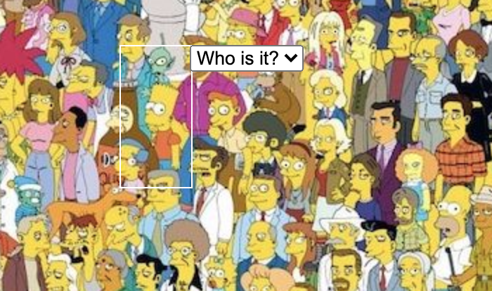

<h1 align="center">Where's Waldo: The Simpsons</h1>

<h2 align="center"><a  href="https://infinite-headland-08203.herokuapp.com/">Live Demo</a></h2>

## Description

A photo tagging web app where users search a photo for specific target characters. Using a node.js/express backend for validation and high score tracking, and a React.js frontend. Done as part of [The Odin Project's curriculum](https://www.theodinproject.com/courses/javascript/lessons/where-s-waldo-a-photo-tagging-app-javascript).
